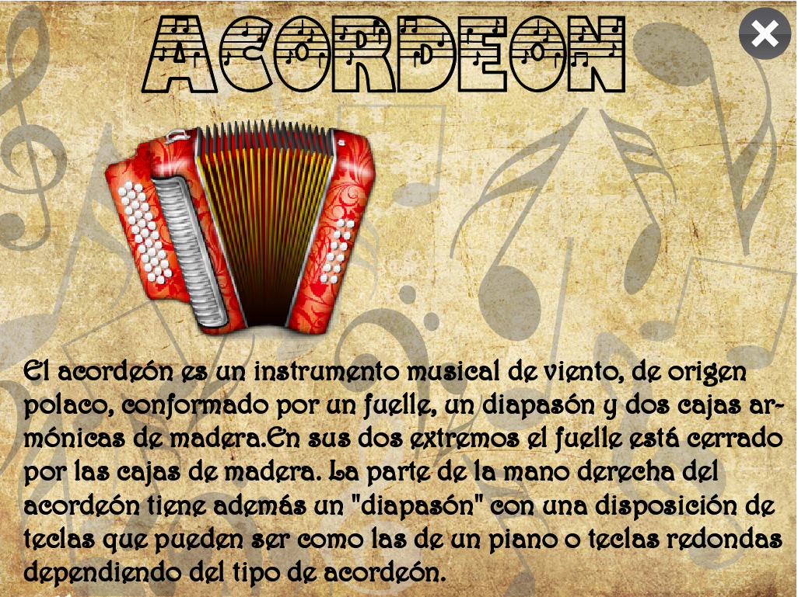
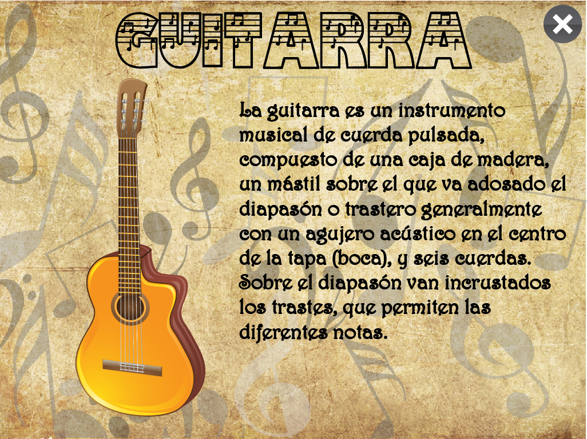
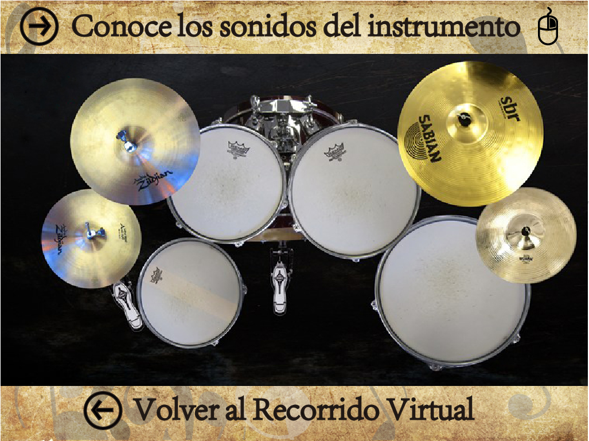
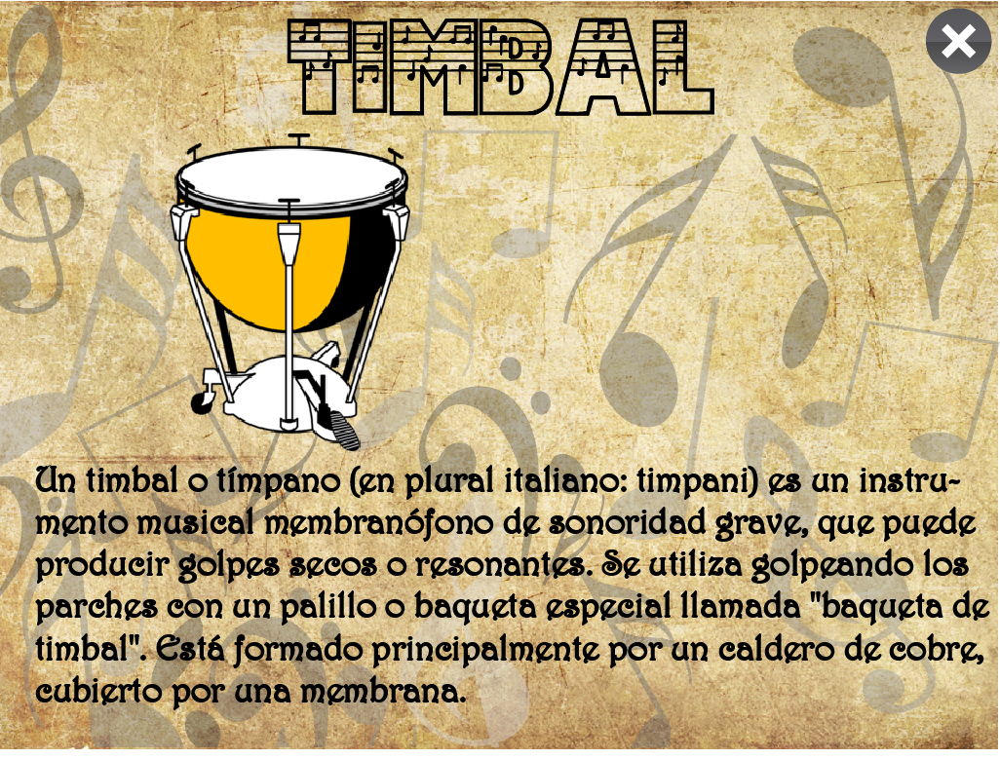
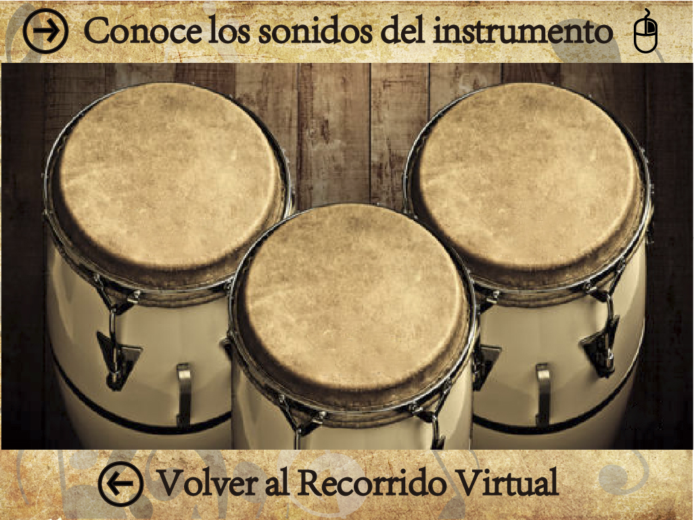

# java3d-videogames

3d mini-games developed in java using jmonkey engine

* [Mars demo](https://www.youtube.com/watch?v=NAtt1_IDXnQ)
* [Interactive Music demo](https://youtu.be/rgS-F3f_ndo)

  
  
  
  
  
  

